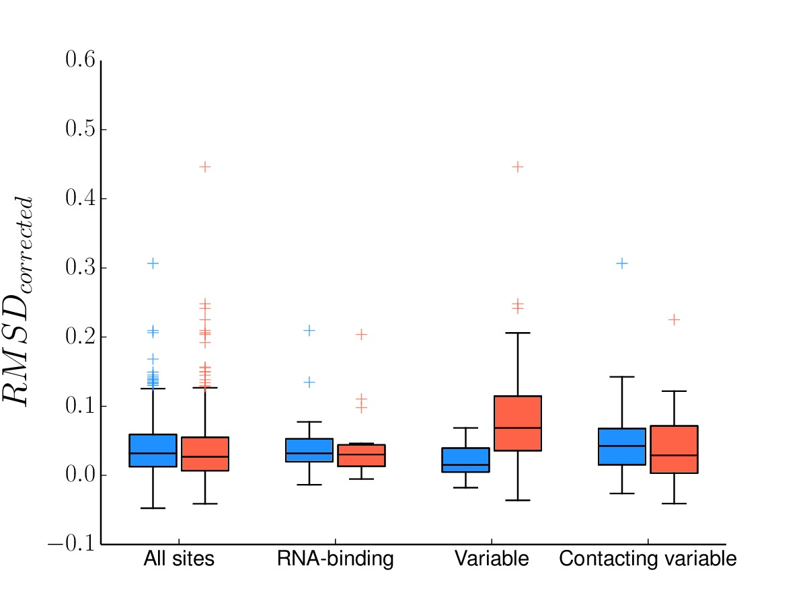

=============================================================================
Analysis of Amino-Acid Preferences in Two Homologs of Influenza Nucleoprotein
=============================================================================

.. contents::
  :depth: 2

Summary
-------

These scripts perform a comparative analysis of site-specific amino-acid preferences inferred from deep mutational scanning data for two homologs of influenza nucleoprotein (NP). First, `mapmuts`_, a package for analyzing deep-sequencing data to identify mutation frequencies in mutant libraries of a gene, is used to process Illumina sequencing data (`SRA Accession #SRP056028`_) for biological replicate mutant libraries of PR/1934(H1N1) and Aichi/1968(H3N2) NP. Next, `dms_tools`_, a package for analyzing deep mutational scanning data, is used to infer site-specific amino-acid preferences for each replicate mutant library. To quantify the extent that amino-acid preferences differ between NP homologs, ``compare_preferences.py`` calculates distance-based statistics that account for experimental noise by describing how different the amino-acid preferences are at each site *between* homologs relative to the experimental noise in amino-acid preferences across replicate experiments *within* each homolog. Finally, `phyloExpCM`_ is used to compare the performance of various codon substituion models based on the amino-acid preferences measured in each homolog to describe sequence evolution within human, swine, avian, and equine influenza NP phylogenetic trees. These scripts were written by Mike Doud and Orr Ashenberg and extensively use `mapmuts`_, `dms_tools`_, and `phyloExpCM`_, which were written by Jesse Bloom.

Required software
-----------------

The analysis pipeline below was performed using the following software:

 * Platform: Linux-3.13.0-39-generic-x86_64-with-Ubuntu-14.04-trusty
 * Python version: 2.7.6
 * numpy version: 1.8.2
 * scipy version: 0.13.3
 * matplotlib version: 1.3.1
 * cython version: 0.20.1post0
 * pystan version: 2.6.0.0
 * weblogolib version: 3.4
 * PyPDF2 version: 1.24
 * `mapmuts`_ version 1.1
 * `dms_tools`_ version 1.1.2
 * `phyloExpCM`_ version 0.32
 * `HyPhy` version 2.220

Running the analysis scripts
----------------------------

The entire analysis can be completed by sequentially running five master scripts: ``run_mapmuts.py``, ``run_dmstools.py``, ``make_correlation_plots.py``, ``compare_preferences.py``, and ``run_phyloanalysis.py``. Each of these master scripts are run at the command line with one argument, the name of a configuration file, which specifies paths to various directories that are used by that script (eg. ``python run_mapmuts.py mapmuts_config_file.txt``). Within each configuration file, each line must contain a directory name and the corresponding path, separated by a space (eg. ``FASTQ_directory /home/user/NP_homologs/FASTQ_files`` )

Running `mapmuts`_
~~~~~~~~~~~~~~~~~~~~

The configuration file for ``run_mapmuts.py`` must contain the following entries:

  * ``adapter_dir`` specifies the directory containing adapter sequences used for trimming during sequence alignment (``R1_adapter_AR0XX.fa``).
  * ``refseq_dir`` specifies the directory containing the reference sequences used for alignment (``PR8_NP.fa`` and ``Aichi68-NP_amplicon.fa``).
  * ``FASTQ_directory`` specifies the directory containing subdirectories storing the FASTQ files. These subdirectories are structured as: ``FASTQ_directory/(replicate)/(amplicon)/sequences.fastq``, with possible replicates including ``PR8_replicate_1``, ``PR8_replicate_2``, ``PR8_replicate_3``, ``Aichi68C_replicate_1``, and ``Aichi68C_replicate_2``, and possible amplicons including ``DNA``, ``virus``, ``mutDNA``, and ``mutvirus``.
  * ``mapmuts_output_dir`` specifies a directory in which the alignments and mutation parsing done by `mapmuts`_ will be saved. This directory is created if it doesn't already exist, and any files in this directory may be overwritten.

Running `dms_tools`_
~~~~~~~~~~~~~~~~~~~~

The configuration file for ``run_dmstools.py`` must contain the following entries:

 * ``mapmuts_output_dir`` must be the same directory specified to ``run_mapmuts.py``.
 * ``dmstools_output_dir`` specifies a directory in which the inferred amino-acid preferences are saved. This directory is created if it doesn't already exist, and any files in this directory may be overwritten.
 * ``previous_aichi_analysis_dir`` specifies a directory containing `previously published`_ `mapmuts`_ analysis for Aichi/1968 NP (analysis directory available `here`_).
 * ``previous_ha_analysis_dir`` specifies a directory containing the `published`_ `mapmuts`_ analysis for `WSN-HA`_.

Running ``make_correlation_plots.py``
~~~~~~~~~~~~~~~~~~~~~~~~~~~~~~~~~~~~~

The configuration file for ``make_correlation_plots.py`` must contain the following entries:

 * ``heatmap_script_path`` specifies the path to the ``correlation_heatmap.py`` script.
 * ``preferencefiles_dir`` specifies the path to the amino-acid preference files generated by `dms_tools`_, and should be the same directory specified as ``dmstools_output_dir`` to ``run_dmstools.py``.
 * ``plot_output_dir`` specifies a directory in which to save various correlation plots. This directory is created if it doesn't already exist, and any files in this directory may be overwritten.

Running ``compare_preferences.py``
~~~~~~~~~~~~~~~~~~~~~~~~~~~~~~~~~~

The configuration file for ``compare_preferences.py`` must contain the following entries:

 * ``preferencefiles_dir`` specifies the path to the amino-acid preference files generated by `dms_tools`_, and should be the same directory specified as ``dmstools_output_dir`` to ``run_dmstools.py``.
 * ``calculate_rmsd_script_path`` specifies the path to the ``calculate_rmsd.py`` script.
 * ``output_directory`` specifies a directory in which to save the amino-acid preference RMSD analyses. This directory is created if it doesn't already exist, and any files in this directory may be overwritten.

Running ``run_phyloanalysis.py``
~~~~~~~~~~~~~~~~~~~~~~~~~~~~~~~~

The configuration file for ``run_phyloanalysis.py`` must contain the following entry:

 * ``basedir`` specifies the path to the base directory for this analysis. This directory should contain the ``dmstools_output`` directory where preference files are saved, the ``phylo_input`` directory containing phylogenetic tree files, and the ``compare_prefs_output`` directory where the amino-acid preference RMSD analyses where done.

Description of the analysis and results
---------------------------------------

The following sections provide a high-level overview of the analyses performed. For more detail on the experimental methods and the analyses performed, refer to the paper and the source code within this repository.

Making alignments
~~~~~~~~~~~~~~~~~

For each amplicon (*DNA*, *mutDNA*, *virus*, *mutvirus*) of each replicate (*PR8_replicate_1*, *PR8_replicate_2*, *PR8_replicate_3*, *Aichi68C_replicate_1*, *Aichi68C_replicate_2*), the master script ``run_mapmuts.py`` calls the `mapmuts`_ script ``mapmuts_makealignments.py`` which aligns paired reads to each other and to a reference sequence. The parameters for **r1files** and **r2files** are unique to each sample and specify the FASTQ files for read 1 and read 2, respectively. **a1file** is also unique to each sample and specifies a FASTA file with the adapter sequence encountered on read 1 if the sequenced insert is less than 150bp (this is used for trimming the adapter sequence, so the unique barcode for each sample must be included in these files). **generange** and **fullgenefile** are unique to each homolog, specifying the nucleotide range of the coding region and a FASTA file of the entire sequenced amplicon. The following alignment parameters are common to all samples (See the `mapmuts documentation`_ for a full description of the alignment method and these parameters):

  * maxa2m 1 (maximum number of mismatches in read 2 adapter sequence)
  * maxa1m 1 (maximum number of mismatches in read 1 adapter sequence)
  * minq 25 (minimum mean quality score across either read of a read pair)
  * minoverlap 100 (minimum overlap between paired reads)
  * maxgenem 10 (maximum number of mismatches between reference sequence and paired read. we expect mismatches in the mutagenized samples.)
  * maxrm 1 (maximum number of mismatches between overlapping pair of reads)
  * maxn 5 (maximum number of ambiguous base calls in either read of a read pair)

Alignments of paired reads to the reference sequences that meet these criteria are saved in subdirectories of the `mapmuts`_ output directory in the form ``/mapmuts_output/replicate/amplicon/replicate_amplicon_alignments.txt.gz``. ``mapmuts_alignmentsummaryplot.py`` makes a summary plot of the number of read pairs aligned, as well as the number of read pairs that fail to pass various criteria, for each sample:

.. figure:: /mapmuts_output/mapmuts_plots/alignmentsummaryplot.jpg
  :width: 25%
  :align: center
  :alt: alignmentsummaryplot.jpg

Only the read pairs that met all alignment criteria are used in the subsequent analysis.

Parsing mutations
~~~~~~~~~~~~~~~~~

``run_mapmuts.py`` calls the `mapmuts`_ script ``mapmuts_parsecounts.py`` to parse each sample's ``_alignments.txt.gz`` file and count and classify observed mutations within the coding region of the gene (See the `mapmuts documentation`_ for a complete description of this script). The parameters **r1exclude** and **r2exclude** are set to ``1 2 3 4 5 6 7 8 9 10 11 12 13 14 15`` for all samples to ignore the first 15 base-pairs of each read from the subsequent analysis since these positions in the reads typically have high error rates. For each sample, the parsed mutations are summarized in counts files (``*_ntcounts.txt``, ``*_codoncounts.txt``, ``*_aacounts.txt``, found in subdirectories in the form ``/replicate/amplicon/`` of the ``mapmuts_output_dir``) that list the number of times each character (nt, codon, or codon translated to amino-acid) is observed at each position. The mutation frequencies for the four amplicons in  *Aichi68C_replicate_1* shown below are representative of the five replicates sequenced and show the introduction of multi-nucleotide mutations during codon mutagenesis and purifying selection against stop codons and nonsynonymous mutations during reverse genetics rescue of mutant viruses:

.. figure:: mapmuts_output/Aichi68C_replicate_1/parsesummary_codon_types_and_nmuts.jpg
  :width: 25%
  :align: center
  :alt: Aichi68C_replicate_1/parsesummary_codon_types_and_nmuts.jpg

Inferring site-specific amino-acid preferences
~~~~~~~~~~~~~~~~~~~~~~~~~~~~~~~~~~~~~~~~~~~~~~

``run_dmstools.py`` calls the `dms_tools`_ script ``dms_inferprefs.py`` to infer site-specific amino-acid preferences for each replicate experiment (*PR8_replicate_1*, *PR8_replicate_2*, *PR8_replicate_3*, *Aichi68C_replicate_1*, *Aichi68C_replicate_2*). The `mapmuts`_ analysis described above summarized deep mutational scanning sequencing data into ``*_codoncounts.txt`` files for the *DNA*, *virus*, *mutDNA*, and *mutvirus* amplicons within each replicate. These codoncounts files are used as pre-selection counts (*mutDNA*), post-selection counts (*mutvirus*), pre-selection error counts (*DNA*), and post-selection error counts (*virus*) in the `algorithm to infer site-specific preferences`_ described in the `dms_tools documentation`_. Amino-acid preferences are saved in text files in the ``dmstools_output_dir``. ``dms_merge.py`` is used to average the replicate amino-acid preference inferences across experimental replicates into a mean preferences file for each experiment, and ``dms_logoplot.py`` is used to visualize these mean amino-acid preferences as logoplot-styled visualizations, saved as PDF files to the ``dmstools_output_dir``, where the height of each amino acid represents the preference of that amino acid at that site. For example, the mean preferences for sites 2 through 498 (all sites except for the start codon were mutated in the *mutDNA* library) for the PR/1934 NP are shown below:

Calculating and visualizing correlations in amino-acid preferences
~~~~~~~~~~~~~~~~~~~~~~~~~~~~~~~~~~~~~~~~~~~~~~~~~~~~~~~~~~~~~~~~~~

The script ``make_correlation_plots.py`` plots the amino-acid preferences and calculates the Pearson's correlation coefficient between mean preferences from several experiments. These plots are saved to the ``plot_output_dir``. Amino-acid preferences for Aichi/1968 measured in 8 biological replicates have been `previously published`_ and the correlation between the mean preferences from that experiment and the mean preferences as measured in 2 addditional biological replicates measured in this study is shown below:

.. figure:: correlation_plots/aichi_aichi_correlation.jpg
  :width: 50%
  :align: center
  :alt: correlation_plots/aichi_aichi_correlation.jpg
  
The correlation between the mean PR/1934 preferences and the overall mean Aichi/1968 preferences is nearly as good:

As expected, there is no correlation between the mean PR/1934 preferences and preferences in a non-homologous protein, the influenza hemagglutinin `WSN-HA`_:

The above correlations were generated using the mean preferences from each experiment, but the heatmap below, also generated by the ``make_correlation_plots.py`` script, shows that the general pattern of preferences being just as correlated between homologs as within a given homolog is also observed in the biological replicate experiments. Each column and row corresponds to preferences measured in a unique biological replicate experiment, and the tiles are shaded by the Pearson's correlation coefficient calculated for each pair of replicates:

Quantifying differences in preferences between two groups of replicate experiments
~~~~~~~~~~~~~~~~~~~~~~~~~~~~~~~~~~~~~~~~~~~~~~~~~~~~~~~~~~~~~~~~~~~~~~~~~~~~~~~~~~

Deep mutational scanning is subject to experimental noise, so there is variation in the inferred preferences between biological replicate experiments. This experimental noise is greater at some sites than others. The analysis in ``compare_prefs.py`` quantifies this site-specific experimental noise and accounts for it when quantifying the changes in preferences observed between homologs. This method is desribed in the paper and the source code, and calculates for each site the root mean square distance within replicates of the same homolog (averaged across both homologs, **RMSD_within**) and the root mean square distance between replicates of different homologs (**RMSD_between**). **RMSD_within** provides a statistic for the experimental noise at a given site, while **RMSD_between** provides a statistic for the observed changes in preference between homologs at a given site. We calculate **RMSD_corrected** by subtracting **RMSD_within** from **RMSD_between** and use it as a quantification of the magnitude of change in preferences between homologs that is not due to experimental noise. This calculation may become more intuitive with the following example sites showing the amino-acid preferences inferred for three biological replicates of PR/1934 and ten biological replicates of Aichi/1968:

The analysis in ``compare_prefs.py`` calculates these RMSD statistics for every site that was mutagenized in our deep mutational scanning experiment (sites 2 through 498). As a control analysis it also calculates these statistics when comparing two independent experiments on Aichi/1968 to each other. These distinct comparisons are run in their own subdirectories in the ``output_directory`` specified to ``compare_prefs.py``. Within each comparison subdirectory of the ``output_directory``, a file named ``*_RMSD_calcs.txt`` is saved which contains the **RMSD_between**, **RMSD_within**, and **RMSD_corrected** calculated for every site in a tab-delimited text file.

To vizualize these RMSD statistics, ``compare_prefs.py`` makes scatter plots showing the relationship between **RMSD_between** and **RMSD_within**. The following scatter plots show the distribution of RMSD statistics as calculated in the control Aichi/1968 previous study vs. Aichi/1968 current study analysis, as well as the PR/1934 vs. Aichi/1968 analysis. Each point represents one site in the protein. Larger **RMSD_within** indicates larger experimental noise at that site, while larger **RMSD_between** indicates larger differences in amino-acid preferences between experiments. The higher the point is above the y=x line, the larger the **RMSD_corrected**. 

Two groups of sites of interest are 1) Sites in the RNA binding groove (highlighted magenta), and 2) sites with variable amino-acid identity between PR/1934 and Aichi/1968 (highlighted lime). Interestingly, the RNA-binding sites tend to have low **RMSD_within**, indicating low levels of experimental noise at these sites. This is not surprising given that we expect these sites to be under strong functional selection, since binding to RNA is one of NP's essential functions. The variable sites, on the other hand, exhibit a lot of experimental noise, as they tend to have high **RMSD_within**.

Generating null models of differences in the measured amino-acid preferences
~~~~~~~~~~~~~~~~~~~~~~~~~~~~~~~~~~~~~~~~~~~~~~~~~~~~~~~~~~~~~~~~~~~~~~~~~~~~

To assess the extent of preference changes that we would expect to observe due to experimental noise alone, we simulated amino-acid preferences under a null model that assumes that the preferences in both homologs are the the same. This simulation procedure is documented in the source code and described in more detail in the methods section of the paper. Briefly, for each comparison made, a null distribution of **RMSD_corrected** is generated by performing 1000 simulated experiments. The null hypothesis in these simulations is that the amino-acid preferences are the same in both experiments of the comparison, so we average the experimental preferences from both experiments being compared and assign them the label of the "true" preferences under the null hypothesis. The simulated experiments draw amino-acid preference vectors from a Dirichlet distribution centered on this "true" set of amino-acid preferences. 

Since each of our experiments had a different level of noise as measured by average correlation between replicates, we tune the noise in the preferences drawn from the Dirichlet with a scaling parameter to result in in a correlation between replicates that matches the experiment being simulated.

The simulated preferences are stored in subdirectories for each simulation, and the **RMSD_corrected** values from all 1000 simulations are combined as used as a null distribution.

The following plots show the distributions of **RMSD_corrected** scores obtained experimentally overlaid with the simulated data:

Analyzing differences in preferences within sites of functional, structural, and evolutionary importance
~~~~~~~~~~~~~~~~~~~~~~~~~~~~~~~~~~~~~~~~~~~~~~~~~~~~~~~~~~~~~~~~~~~~~~~~~~~~~~~~~~~~~~~~~~~~~~~~~~~~~~~~

The ``compare_prefs.py`` script also analyzes the distributions of **RMSD_corrected** for subgroups of sites. The relevant subgroups we test here are 1) the RNA-binding sites in NP, 2) the sites with variable amino-acid identity between PR/1934 and Aichi/1968, and 3) conserved sites that are in structural contact with variable sites. The distributions of **RMSD_corrected** for these subgroups of sites are shown below, in blue for the comparison between Aichi/1968 previous study and Aichi/1968 current study, and in red for the comparison between PR/1934 and Aichi/1968. Notably, the variable sites have significantly larger **RMSD_corrected** when comparing two homologs than when comparing two experiments on the same homolog, but there are no significant differences in the other subgroups.

Using amino-acid preferences to build codon substitution models
~~~~~~~~~~~~~~~~~~~~~~~~~~~~~~~~~~~~~~~~~~~~~~~~~~~~~~~~~~~~~~~

The ``run_phyloanalysis.py`` program calls scripts from the ``phyloExpCM`` and ``HyPhy`` packages to build an experimentally informed site-specific substitution model for influenza nucleoprotein, and then calculates the likelihood of a nucleoprotein phylogenetic tree given the substitution model. The script is run as ``python run_phyloanalysis.py phylo_config.txt`` and all output is written to the directory ``phylo_output``.

.. figure:: phylo_output/Aichi1968_PR1934_minus_Aichi1968_Allhosts_binnedlikelihood_RMSDwithin.jpg
  :scale: 30%
  :align: center

Analyzing performance of amino-acid preference-based substitution models
~~~~~~~~~~~~~~~~~~~~~~~~~~~~~~~~~~~~~~~~~~~~~~~~~~~~~~~~~~~~~~~~~~~~~~~~

.. _`mapmuts`: https://github.com/jbloom/mapmuts
.. _`mapmuts documentation`: http://jbloom.github.io/mapmuts/
.. _`dms_tools`: https://github.com/jbloom/dms_tools
.. _`algorithm to infer site-specific preferences`: http://jbloom.github.io/dms_tools/inferprefs_algorithm.html
.. _`dms_tools documentation`: http://jbloom.github.io/dms_tools/
.. _`Python`: http://www.python.org/
.. _`phyloExpCM`: https://github.com/jbloom/phyloExpCM
.. _`previously published`: http://dx.doi.org/10.1093/molbev/msu173
.. _`here`: https://github.com/jbloom/mapmuts/tree/master/examples/2013Analysis_Influenza_NP_Aichi68
.. _`WSN-HA`: https://github.com/jbloom/mapmuts/tree/master/examples/WSN_HA_2014Analysis
.. _`published`: http://dx.doi.org/10.7554/eLife.03300
.. _`SRA Accession #SRP056028`: http://www.ncbi.nlm.nih.gov/sra/?term=SRP056028[Accession]
